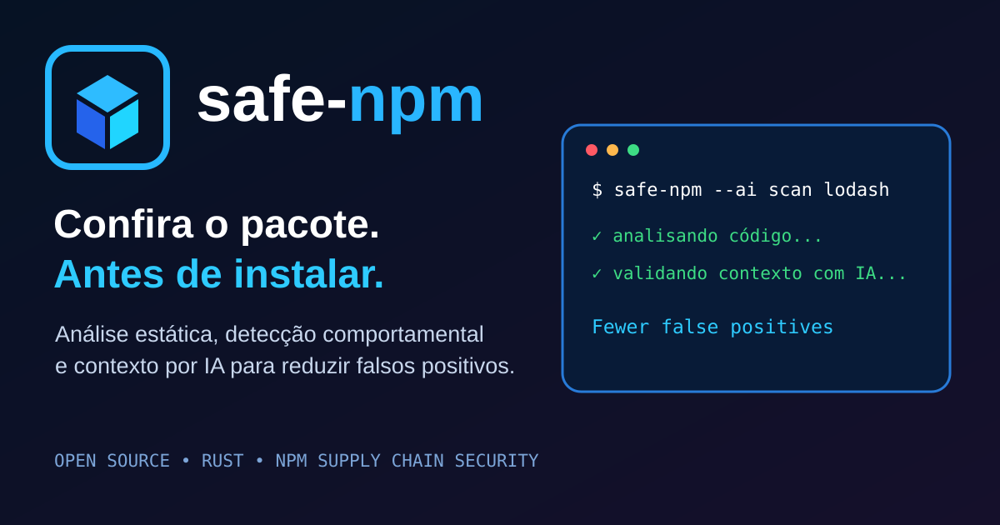

<p align="center">
  
</p>

**English** | [Português (Brasil)](README-pt-BR.md)

**See the package before it executes.** safe-npm is a local-first static security scanner for npm packages, written in Rust.

> v0.5 adds contextual evidence, false-positive resistant scoring and optional OpenAI validation on top of the local static scanner. Package code is never executed by safe-npm.

## v0.5: context-aware analysis + optional AI validation

v0.5 addresses the false positives exposed by the real-package calibration.

- **Rule-deduplicated scoring:** repeated occurrences of the same rule no longer multiply the package score.
- **Context evidence:** findings keep a small source excerpt around the matched behavior.
- **More specific static rules:** generic URLs are no longer sufficient to represent network access, and process execution focuses on concrete execution APIs.
- **Optional OpenAI validation:** pass `--ai` and set `OPENAI_API_KEY` to review MEDIUM/HIGH/CRITICAL findings using their local context.
- **AI is not required:** without `--ai`, no source context is sent to OpenAI and safe-npm remains local-first.
- AI findings marked `false_positive` with confidence >= 0.80 are excluded before the package risk is recalculated.
- The default AI model is `gpt-5.6-luna`; override it with `--ai-model`.

```bash
export OPENAI_API_KEY="your-key"
safe-npm --ai scan lodash
safe-npm --ai tree express
safe-npm --ai --ai-model gpt-5.6-luna tree axios
```

### Privacy and cost

AI validation sends the rule name, file path and a short source excerpt for MEDIUM/HIGH/CRITICAL findings to the OpenAI Responses API. It does not upload the complete package by design. Enabling `--ai` can incur OpenAI API charges and requires network access. Review your organization's source-code and data-handling policies before enabling it.

## v0.4 highlights

- **Behavior correlation:** escalates credential/environment + network and network + execution combinations to CRITICAL.
- **Project policy:** optional `.safe-npm.toml` controls `block_at`, denied rules, exact package allowlist and traversal limits.
- **SARIF 2.1.0:** `safe-npm tree express --sarif` for GitHub Code Scanning and other SARIF consumers.
- Policy is enforced by `scan` and `install`; tree traversal honors policy limits.
- Fixes the v0.3 strict-clippy CI failures.

## v0.3 intelligence

- **Typosquatting heuristic:** flags names one edit away from a curated set of popular npm packages.
- **Registry trust signals:** deprecated versions, missing maintainers and extremely short version history.
- **Obfuscation-density heuristic:** detects unusually long/minified lines and dense hex/unicode escape usage.
- Registry signals are scored together with source-code findings across the full dependency tree.
- All v0.2 dependency-tree protections remain: SemVer resolution, cycle/dedup protection, bounded traversal and safe install policy.

## v0.2 foundation

- Recursive dependency-tree scanning with cycle/dedup protection.
- SemVer range resolution against the npm Registry.
- Configurable `--max-depth` (default 8) and `--max-packages` (default 500).
- Aggregated tree risk: the highest package risk becomes the installation policy risk.
- Unsupported git/file/http dependency sources are reported instead of silently trusted.
- Existing single-package `scan` mode remains available.
- `install` now scans the dependency tree before allowing npm to run.
- Lifecycle scripts stay disabled by default with `--ignore-scripts`.
- JSON tree report for CI/CD.
- Static landing page in `docs/`, ready for GitHub Pages.

## Install

Prebuilt binaries are attached to every GitHub release:

- Linux x86_64: `safe-npm-linux-x86_64.tar.gz`
- Windows x86_64: `safe-npm-windows-x86_64.zip`
- macOS Universal (Intel + Apple Silicon): `safe-npm-macos-universal.tar.gz`

You can also build/install directly from source:

```bash
cargo install --git https://github.com/mdnbras/safe-npm
```

## Usage

Single tarball:

```bash
safe-npm scan lodash
safe-npm scan lodash --json
safe-npm scan lodash --html
safe-npm scan lodash --html reports/lodash.html
```

HTML reports are standalone files and include the package score, risk level, severity summary, detailed findings, source evidence and AI validation when `--ai` is enabled. Running `--html` without a path writes `safe-npm-report.html`.

Full production dependency tree:

```bash
safe-npm tree express
safe-npm tree express --max-depth 10 --max-packages 1000
safe-npm tree express --json
```

Scan the tree and install only if policy allows:

```bash
safe-npm install express
```

HIGH or CRITICAL anywhere in the scanned tree blocks installation. Overrides are explicit:

```bash
safe-npm install package --allow-risk
safe-npm install package --allow-scripts
```

## Real package calibration

The v0.5 AI calibration uses **lodash** as a single reproducible example. The result below comes from the repository's `AI package test` GitHub Actions workflow, run on 2026-10-01 with AI validation enabled.

| Package | Version | Files scanned | Final findings | Score | Risk |
|---|---:|---:|---:|---:|---|
| lodash | 4.18.1 | 1,049 | 5 | 30/100 | MEDIUM |

### Evidence from the AI package test

The final report kept five findings. The examples below show why safe-npm treats AI as contextual evidence rather than a malware verdict.

- **encoded-payload · `package/lodash.js` · MEDIUM**: `uncertain`, confidence **0.96**. The AI assessment noted that the detected `String.fromCharCode(o.code)` can be legitimate utility behavior and that the supplied excerpt did not show payload decoding, obfuscation or execution strongly enough to confirm a security-relevant behavior.
- **network-access · `package/templateSettings.js` · MEDIUM**: `uncertain`, confidence **0.99**. The supplied evidence was a Lodash threat-model link rather than code demonstrating a network request, so the AI assessment did not confirm network access.
- **obfuscation-density · 3 findings · MEDIUM**: `not_analyzed`. These findings did not contain contextual source evidence, so safe-npm preserved them instead of asking the AI to guess.

This is intentionally not a statement that lodash is safe or unsafe. It demonstrates the v0.5 flow: static detection produces review signals, contextual evidence is sent to the optional AI validator, and uncertain or non-analyzed findings remain visible.

The source result is generated by the manual `AI package test` workflow and uploaded as the `lodash-ai-report` artifact.

Run the same calibration locally:

```bash
export OPENAI_API_KEY="your-key"
cargo build --release
./target/release/safe-npm --ai scan lodash --json
```

## What is detected?

The current ruleset looks for lifecycle scripts, process/shell execution, dynamic code execution, credential/token access, environment access, network-capable code and encoded/obfuscated payload indicators.

| Severity | Weight |
|---|---:|
| LOW | 3 |
| MEDIUM | 10 |
| HIGH | 25 |
| CRITICAL | 40 |

Package score: LOW 0–19, MEDIUM 20–44, HIGH 45–74, CRITICAL 75–100.

## Architecture

```text
package@range
     |
     v
npm Registry metadata
     |
     +---- resolve SemVer ----+
     |                       |
     v                       v
download root .tgz       dependency ranges
     |                       |
     v                       +---- recursive queue
static scanner                        |
     |                                v
     +---------------------- scan dependency .tgz
                              |
                              v
                    deduplicate / prevent cycles
                              |
                              v
                    aggregate tree risk
                              |
                 +------------+-------------+
                 |                          |
              report                 install policy
                                      |
                             npm --ignore-scripts
```

## Landing page

The website source lives in `docs/`. A GitHub Pages workflow is included at `.github/workflows/pages.yml`.

If Pages is configured to use **GitHub Actions** as its source, pushes affecting `docs/` automatically deploy the site.

## Security boundaries

safe-npm v0.5 deliberately does not execute downloaded packages. Individual source files larger than 2 MiB are skipped. Tree traversal is bounded by depth and package count. Git, local-file and direct HTTP dependency sources are currently reported as unsupported rather than fetched.

The scanner is heuristic: **a finding is not proof of malware, and a clean report is not proof of safety.** Use safe-npm as one defense-in-depth layer alongside npm audit, provenance/signature verification, lockfiles, review and runtime isolation.

## Roadmap

- AST-based JavaScript/TypeScript analysis.
- Typosquatting and package-name similarity.
- Registry signature/provenance verification.
- Package age, maintainer and release-anomaly signals.
- Entropy/minification heuristics.
- Configurable policies and allowlists.
- SARIF / GitHub Code Scanning.
- Parallel downloads/scanning and metadata cache.

## Policy

Create `.safe-npm.toml` in the project root or pass `--policy path/to/policy.toml`:

```toml
block_at = "HIGH"
max_depth = 8
max_packages = 500
deny_rules = ["credential-access", "behavior-secret-exfiltration", "behavior-download-execute"]
allow_packages = []
```

Generate SARIF:

```bash
safe-npm tree express --sarif > safe-npm.sarif
```

## Development

```bash
cargo fmt --check
cargo clippy --all-targets --all-features -- -D warnings
cargo test --all-features
cargo build --release
```

## Contributing

Contributions are welcome. Read [CONTRIBUTING.md](CONTRIBUTING.md) for the development workflow, testing requirements and security-specific review guidelines. Pull requests are automatically reviewed by CodeRabbit when the GitHub App is enabled for this repository.

## Community and security

- [Contributing](CONTRIBUTING.md)
- [Security Policy](SECURITY.md)
- [Code of Conduct](CODE_OF_CONDUCT.md)

## License

MIT
