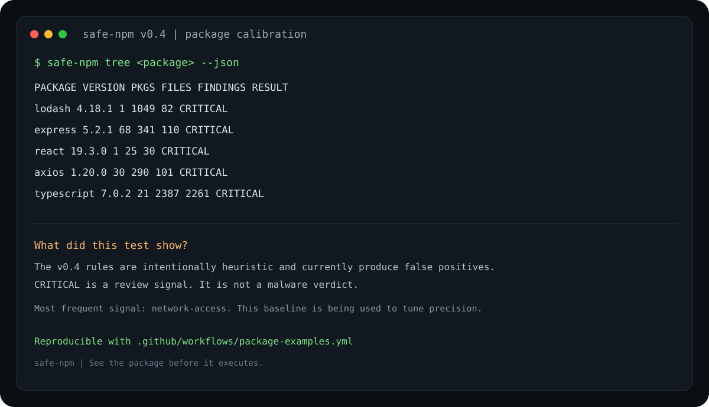

# safe-npm

**See the package before it executes.** safe-npm is a local-first static security scanner for npm packages, written in Rust.

> v0.4 combines behavioral correlation, configurable policy, SARIF, static source scanning, transitive dependency analysis and npm Registry intelligence **before package execution**.

## v0.4 highlights

- **Behavior correlation:** escalates credential/environment + network and network + execution combinations to CRITICAL.
- **Project policy:** optional `.safe-npm.toml` controls `block_at`, denied rules, exact package allowlist and traversal limits.
- **SARIF 2.1.0:** `safe-npm tree express --sarif` for GitHub Code Scanning and other SARIF consumers.
- Policy is enforced by `scan` and `install`; tree traversal honors policy limits.
- Fixes the v0.3 strict-clippy CI failures.

## v0.3 intelligence

- **Typosquatting heuristic:** flags names one edit away from a curated set of popular npm packages.
- **Registry trust signals:** deprecated versions, missing maintainers and extremely short version history.
- **Obfuscation-density heuristic:** detects unusually long/minified lines and dense hex/unicode escape usage.
- Registry signals are scored together with source-code findings across the full dependency tree.
- All v0.2 dependency-tree protections remain: SemVer resolution, cycle/dedup protection, bounded traversal and safe install policy.

## v0.2 foundation

- Recursive dependency-tree scanning with cycle/dedup protection.
- SemVer range resolution against the npm Registry.
- Configurable `--max-depth` (default 8) and `--max-packages` (default 500).
- Aggregated tree risk: the highest package risk becomes the installation policy risk.
- Unsupported git/file/http dependency sources are reported instead of silently trusted.
- Existing single-package `scan` mode remains available.
- `install` now scans the dependency tree before allowing npm to run.
- Lifecycle scripts stay disabled by default with `--ignore-scripts`.
- JSON tree report for CI/CD.
- Static landing page in `docs/`, ready for GitHub Pages.

## Install

```bash
cargo install --git https://github.com/mdnbras/safe-npm
```

## Usage

Single tarball:

```bash
safe-npm scan lodash
safe-npm scan lodash --json
```

Full production dependency tree:

```bash
safe-npm tree express
safe-npm tree express --max-depth 10 --max-packages 1000
safe-npm tree express --json
```

Scan the tree and install only if policy allows:

```bash
safe-npm install express
```

HIGH or CRITICAL anywhere in the scanned tree blocks installation. Overrides are explicit:

```bash
safe-npm install package --allow-risk
safe-npm install package --allow-scripts
```

## Real package calibration

To exercise the scanner against real-world code, v0.4 was run against five widely used npm packages: `lodash`, `express`, `react`, `axios` and `typescript`. The test ran on 2026-10-01 using the versions resolved by the npm Registry at that time.

These are examples of heavily used packages, not a permanent or authoritative "top 5" ranking. npm download counts and package versions change over time.

| Package | Version | Packages scanned | Files scanned | Findings | Tree risk |
|---|---:|---:|---:|---:|---|
| lodash | 4.18.1 | 1 | 1,049 | 82 | CRITICAL |
| express | 5.2.1 | 68 | 341 | 110 | CRITICAL |
| react | 19.3.0 | 1 | 25 | 30 | CRITICAL |
| axios | 1.20.0 | 30 | 290 | 101 | CRITICAL |
| typescript | 7.0.2 | 21 | 2,387 | 2,261 | CRITICAL |



### What the results mean

This calibration exposed an important limitation in the current ruleset. All five packages reached CRITICAL, with `network-access` responsible for most findings. For example, TypeScript produced 2,170 `network-access` findings and lodash produced 70.

**This table must not be read as a claim that these packages contain malware.** A safe-npm risk level is a heuristic review signal. The test shows that v0.4 still needs better context awareness and rule precision before the score can be treated as a strong package-level security classification.

That is exactly why these examples are kept in the repository: they provide a repeatable baseline for measuring false-positive reduction in future versions.

The raw JSON reports are generated by the `Package examples` GitHub Actions workflow and uploaded as the `safe-npm-package-examples` artifact.

Run the same test locally:

```bash
cargo build --release

for pkg in lodash express react axios typescript; do
  ./target/release/safe-npm tree "$pkg" --json > "$pkg.json"
done
```

## What is detected?

The current ruleset looks for lifecycle scripts, process/shell execution, dynamic code execution, credential/token access, environment access, network-capable code and encoded/obfuscated payload indicators.

| Severity | Weight |
|---|---:|
| LOW | 3 |
| MEDIUM | 10 |
| HIGH | 25 |
| CRITICAL | 40 |

Package score: LOW 0–19, MEDIUM 20–44, HIGH 45–74, CRITICAL 75–100.

## Architecture

```text
package@range
     |
     v
npm Registry metadata
     |
     +---- resolve SemVer ----+
     |                       |
     v                       v
download root .tgz       dependency ranges
     |                       |
     v                       +---- recursive queue
static scanner                        |
     |                                v
     +---------------------- scan dependency .tgz
                              |
                              v
                    deduplicate / prevent cycles
                              |
                              v
                    aggregate tree risk
                              |
                 +------------+-------------+
                 |                          |
              report                 install policy
                                      |
                             npm --ignore-scripts
```

## Landing page

The website source lives in `docs/`. A GitHub Pages workflow is included at `.github/workflows/pages.yml`.

If Pages is configured to use **GitHub Actions** as its source, pushes affecting `docs/` automatically deploy the site.

## Security boundaries

safe-npm v0.4 deliberately does not execute downloaded packages. Individual source files larger than 2 MiB are skipped. Tree traversal is bounded by depth and package count. Git, local-file and direct HTTP dependency sources are currently reported as unsupported rather than fetched.

The scanner is heuristic: **a finding is not proof of malware, and a clean report is not proof of safety.** Use safe-npm as one defense-in-depth layer alongside npm audit, provenance/signature verification, lockfiles, review and runtime isolation.

## Roadmap

- AST-based JavaScript/TypeScript analysis.
- Typosquatting and package-name similarity.
- Registry signature/provenance verification.
- Package age, maintainer and release-anomaly signals.
- Entropy/minification heuristics.
- Configurable policies and allowlists.
- SARIF / GitHub Code Scanning.
- Parallel downloads/scanning and metadata cache.

## Policy

Create `.safe-npm.toml` in the project root or pass `--policy path/to/policy.toml`:

```toml
block_at = "HIGH"
max_depth = 8
max_packages = 500
deny_rules = ["credential-access", "behavior-secret-exfiltration", "behavior-download-execute"]
allow_packages = []
```

Generate SARIF:

```bash
safe-npm tree express --sarif > safe-npm.sarif
```

## Development

```bash
cargo fmt --check
cargo clippy --all-targets --all-features -- -D warnings
cargo test --all-features
cargo build --release
```

## License

MIT
